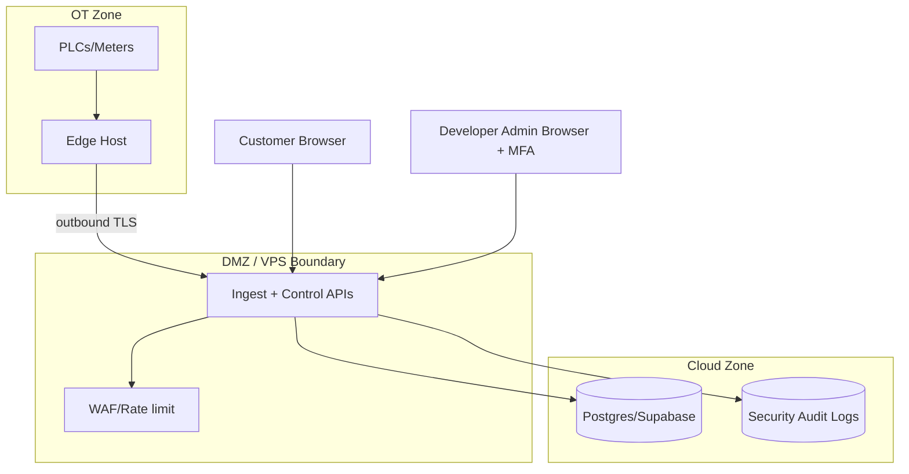
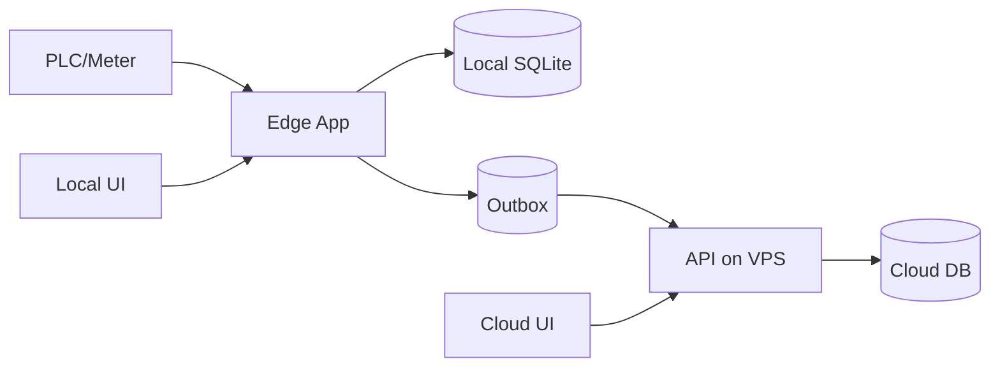
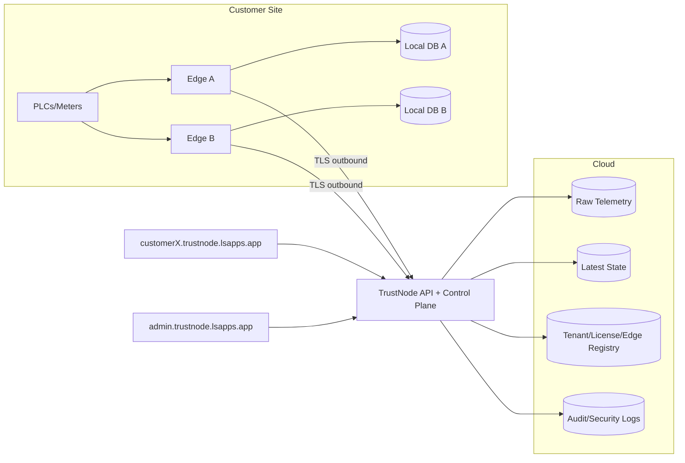
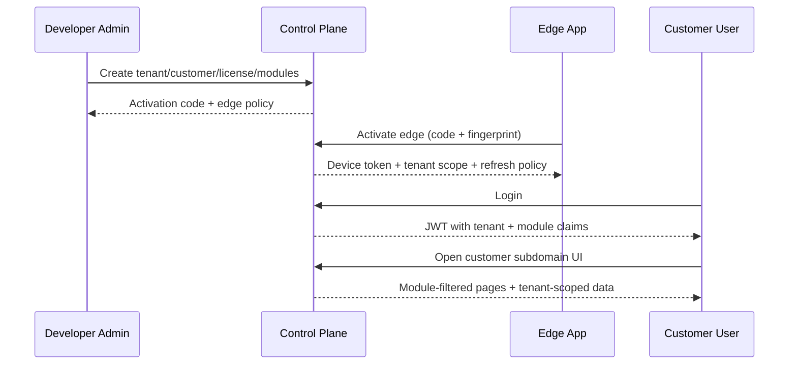

# TrustNode Scalability & Commercialization Architecture Report

**Date:** 22 April 2026  
**Scope:** Minimal-change evolution of the current TrustNode architecture for multi-customer production rollout (secure, low-cost, scalable, near-real-time).  
**Prepared for:** TrustNode product and engineering team

---

## 1) Executive Summary

You already have the right core foundation in code:

- Edge-first collection with local durability (`telemetry_samples_raw`, `latest_machine_state`, outbox).
- Device-scoped ingest API (`/api/v1/ingest/batch`) with token scope checks.
- Tenant-aware cloud schema and RLS baseline migration.
- UI model separating live and historical views.

The best path now is **not a big rewrite**. The best path is to add a thin **Control Plane** over what you already have:

- Central tenant/customer/edge/license registry.
- Per-edge activation + credential rotation workflow.
- Strict cloud tenant isolation everywhere.
- Per-customer URL routing (`customer.trustnode.lsapps.app`) with host-to-tenant resolution.
- Hardened real-time path using `latest_machine_state` for live UI and raw table only for historian/reporting.

This gives you a production SaaS posture with minimal disruption to your current stack.

---

## 2) Current Architecture (What You Have Now)

### 2.1 Confirmed strengths from current codebase

- **Edge telemetry service** already implements:
  - local append-only writes,
  - outbox queue,
  - retries/backoff,
  - gzip batch upload,
  - device token flow.
- **Cloud ingest** already implements:
  - `/api/v1/ingest/batch`,
  - idempotency by `edge_record_id`,
  - latest-state upsert logic,
  - ingest audit records.
- **Tenant plumbing** already exists:
  - request/websocket tenant resolution,
  - host-based tenant extraction for `*.trustnode.lsapps.app`,
  - tenant-aware read paths.

### 2.2 Current friction points

- Tenant and user lifecycle still partly config-driven instead of control-plane-driven.
- Some edge instances show sync failures due to missing ingest URL/token bootstrap (`missing_vps_ingest_url` path).
- Shared cloud DB is feasible but needs stricter isolation governance and per-tenant ops boundaries.
- Commercial operations (onboarding, licensing, module entitlement, password recovery, edge enable/disable) are not yet first-class.

---

## 3) Target Production Model (Minimal Change)

## 3.1 Design principle

Keep your existing telemetry architecture. Add a compact control-plane layer and enforce tenant isolation consistently.

## 3.2 Three-plane architecture

```mermaid
flowchart LR
  subgraph OT[OT Site]
    PLC[PLCs / Meters]
    EDGE[TrustNode Edge App]
    SQLITE[(Local SQLite)]
    PLC --> EDGE
    EDGE --> SQLITE
  end

  EDGE -- outbound HTTPS only --> VPS[TrustNode VPS API]

  subgraph CLOUD[Cloud Data Plane]
    INGEST[/api/v1/ingest/batch]
    RAW[(telemetry_samples_raw)]
    LATEST[(latest_machine_state)]
    AUDIT[(ingest_audit_log)]
    INGEST --> RAW
    INGEST --> LATEST
    INGEST --> AUDIT
  end

  VPS --> INGEST

  subgraph CONTROL[Control Plane]
    REG[(customer/tenant/edge/license registry)]
    IAM[(user auth + MFA + RBAC)]
    PROV[edge activation + credential rotation]
    REG --> PROV
    IAM --> REG
  end

  subgraph PRESENT[Presentation Plane]
    WEB[Customer Web UI]
    ADMIN[Developer/Admin Portal]
  end

  WEB --> VPS
  ADMIN --> VPS
  VPS --> CONTROL
```

## 3.3 Why this is best for now

- No Kafka/K8s/MQTT required.
- No inbound internet into OT.
- Reuses your current FastAPI + SQLite + Postgres/Supabase model.
- Adds commercial features (licensing, tenant URLs, user provisioning) without rewriting ingest pipeline.

---

## 4) Multi-Customer Data Strategy

## 4.1 Recommended model now

Use **pooled cloud DB** with strict tenant isolation and optional premium dedicated tenancy later.

- Keep one main cloud cluster initially for cost.
- Every row carries `tenant_id` and `edge_id`/`gateway_id` provenance.
- Enforce RLS + API tenant claim checks + device token scope checks.

## 4.2 Future-ready tenancy tiers

| Tier | Isolation model | Cost | Complexity | Recommended use |
|---|---|---:|---:|---|
| Tier A | Shared DB + RLS | Low | Low | SMB/default customers |
| Tier B | Shared cluster, separate schema/database | Medium | Medium | Regulated mid-size customers |
| Tier C | Dedicated project/cluster per tenant | High | High | Enterprise/compliance-heavy |

Start with Tier A globally, offer Tier B/C as paid upgrade.

---

## 5) Customer URL Strategy

## 5.1 Best route

Use wildcard subdomain routing at your reverse proxy:

- `customer-a.trustnode.lsapps.app`
- `customer-b.trustnode.lsapps.app`

Host header resolves tenant context.

## 5.2 Why not use Supabase custom domain per tenant

Supabase custom domains are useful, but per project they are limited (single custom domain per project). This is not ideal for many-customer frontend tenancy by itself.

Best practical model:

- Keep TrustNode web frontend/API behind your VPS/reverse proxy for tenant host routing.
- Keep Supabase as data plane behind backend APIs and/or server-side service flows.

---

## 6) Identity, Roles, and Licensing

## 6.1 Separate human and machine identities

- **Human**: user login with role/module permissions, MFA for admin/operator-critical roles.
- **Machine**: edge device token (tenant-scoped + edge/gateway-scoped), short TTL + rotation.

## 6.2 Control-plane tables to add (minimal)

- `tenants`
- `customers`
- `edges`
- `licenses`
- `license_modules`
- `edge_activation_codes`
- `user_tenant_memberships`
- `password_reset_events`
- `security_audit_log`

## 6.3 Operational flows

- Developer admin creates customer + plan + modules.
- Edge boots, requests activation code validation.
- Control plane returns edge identity + tenant binding + policy snapshot.
- Customer users only see modules enabled by license.

---

## 7) Real-Time and Historian Consistency Model

## 7.1 Required invariant

At a given event timestamp, the record must be identical across:

- edge local raw,
- outbox payload,
- cloud raw,
- historian/report queries.

## 7.2 Live + historical query split (keep)

- **Live dashboards**: read from `latest_machine_state` stream only.
- **Historian/reporting**: read from `telemetry_samples_raw` (time-window queries).

Do not poll full history every second for live cards.

## 7.3 Latency target

- Edge local live: <= 1s from sample commit.
- Cloud live UI: <= 2s p95 from edge `sample_ts` to UI update.

---

## 8) Security Model (IT/OT Safe)



### 8.1 Enforcement checklist

- Edge outbound-only to VPS.
- No direct browser access to OT assets.
- No service-role or raw DB master credentials in browser or edge UI bundles.
- RLS enforced on all user-accessible data tables.
- Device token includes tenant and gateway scope claims.
- Admin MFA and privileged action audit logs.

---

## 9) Cloud Database Recommendations

## 9.1 Keep current core tables

- `telemetry_samples_raw` (immutable)
- `latest_machine_state` (mutable live state)
- `ingest_audit_log`

## 9.2 Add partitioning for growth

Partition `telemetry_samples_raw` by time (monthly or weekly based on volume), with existing indexes per tenant/gateway/time.

## 9.3 Retention model

- Hot window in primary partitions.
- Archive/export partitions before drop.
- Per-tenant retention policies (contract-aware).

---

## 10) Performance & Cost Guidance

## 10.1 Low-cost baseline that scales

- Keep one VPS API tier + one Supabase project (shared tenant model).
- Add read replicas only when read load justifies it.
- Keep write path on primary only.

## 10.2 Connection strategy

- Persistent backend services: direct or session pool mode.
- Burst/serverless workloads: transaction pool mode.
- Monitor connection limits and pooler client counts.

## 10.3 Backlog control

- Batch ingest by payload size and time budget.
- Cloud ack in chunks.
- Adaptive retry with jitter.
- Alert on outbox depth and oldest unsynced age.

---

## 11) AI/VPS Strategy for Future Product Intelligence

## 11.1 Best architecture

- Keep AI in a **separate analytics service** in VPS/cloud.
- Feed AI from curated feature tables/materialized views, not raw write path.
- Keep AI read-only against production telemetry data.

## 11.2 Why

- No risk to ingestion latency.
- Better cost control.
- Easier model governance per tenant.

## 11.3 Multi-tenant AI safety

- Tenant-scoped inference jobs.
- Tenant-scoped vector stores/features.
- Strict no cross-tenant prompts/data mixing.

---

## 12) Minimal-Change Rollout Plan

## Phase 0 (1-2 weeks): Stabilize existing pipeline

- Fix/standardize edge cloud ingest bootstrap (`TRUSTNODE_VPS_INGEST_URL`, token issuance flow).
- Add startup diagnostics panel for ingest URL, token status, tenant scope, pending outbox age.
- Add hard alarms for sync misconfiguration.

## Phase 1 (2-3 weeks): Control plane core

- Add tenant/customer/edge/license tables and APIs.
- Add edge activation flow.
- Bind edge identity to tenant and license modules.

## Phase 2 (2-3 weeks): Customer URL and isolation hardening

- Deploy wildcard subdomain routing.
- Enforce host->tenant mapping with deny-by-default fallback.
- Enforce all user reads via tenant-scoped API endpoints.

## Phase 3 (2-4 weeks): Security and ops hardening

- Admin MFA enforcement.
- Security audit events for auth/config/license actions.
- PITR backup strategy + restore drills.

## Phase 4 (ongoing): Scale options

- Tenant tiering (shared vs dedicated).
- Read replicas for heavy reporting tenants.
- Optional per-tenant dedicated deployments for enterprise contracts.

---

## 13) Acceptance Criteria

- Multiple edges per customer stream concurrently without cross-tenant leakage.
- Cloud UI can switch edges for same tenant account safely.
- p95 cloud live latency <= 2s.
- Outbox oldest unsynced age alarmed and bounded under normal connectivity.
- Full audit trail for login, config, licensing, token issuance, sync failures.
- Tenant isolation validated by automated cross-tenant access tests.

---

## 14) Immediate Recommended Actions (Next 7 Days)

1. Normalize and lock edge ingest bootstrap variables in installer/portable startup.
2. Introduce `edge_id` and explicit edge registration/heartbeat table.
3. Add control-plane admin page for customer, modules, and edge activation state.
4. Add wildcard subdomain routing and host-based tenant binding checks.
5. Add smoke test pack that validates:
- local collect,
- outbox enqueue,
- cloud ack,
- latest-state freshness,
- tenant isolation.

---

## 15) Topology Pictures

## 15.1 Current (simplified)



## 15.2 Target (commercial-ready minimal change)



## 15.3 Auth and licensing flow



---

## 16) External References (Used for design decisions)

- PostgreSQL Row-Level Security: https://www.postgresql.org/docs/current/ddl-rowsecurity.html
- PostgreSQL Date/Time types (`timestamptz` UTC behavior): https://www.postgresql.org/docs/current/datatype-datetime.html
- PostgreSQL partitioning: https://www.postgresql.org/docs/current/ddl-partitioning.html
- Supabase RLS guidance: https://supabase.com/docs/guides/database/postgres/row-level-security
- Supabase API security guidance: https://supabase.com/docs/guides/api/securing-your-api
- Supabase connection methods/poolers: https://supabase.com/docs/guides/database/connecting-to-postgres
- Supabase read replicas: https://supabase.com/docs/guides/platform/read-replicas
- Supabase custom domains limitations: https://supabase.com/docs/guides/platform/custom-domains
- Supabase backups/PITR: https://supabase.com/docs/guides/platform/backups
- Supabase MFA: https://supabase.com/docs/guides/auth/auth-mfa
- NIST SP 800-82r3 (OT security): https://csrc.nist.gov/pubs/sp/800/82/r3/final
- NIST SP 800-82r3 PDF (DMZ, zones, outbound/inbound controls): https://nvlpubs.nist.gov/nistpubs/SpecialPublications/NIST.SP.800-82r3.pdf
- OWASP API Security Top 10 (2023): https://owasp.org/API-Security/editions/2023/en/0x11-t10/
- Cloudflare wildcard DNS records: https://developers.cloudflare.com/dns/manage-dns-records/reference/wildcard-dns-records/
- NGINX wildcard host routing (`server_name`): https://nginx.org/en/docs/http/server_names.html
- Let’s Encrypt challenge types (wildcards via DNS-01): https://letsencrypt.org/docs/challenge-types/
- AWS tenant isolation concepts: https://docs.aws.amazon.com/whitepapers/latest/saas-architecture-fundamentals/tenant-isolation.html

---

## 17) Final Recommendation

Build your product around a **shared-control-plane + tenant-isolated data-plane** model, preserving your current edge ingestion architecture.  
This gives you the fastest route to sellable, secure, low-cost deployments while keeping a clean upgrade path to enterprise isolation tiers.
